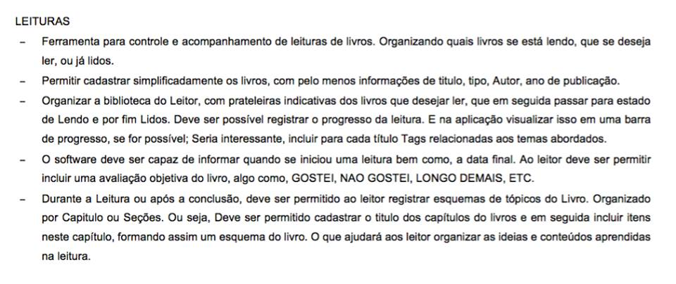

##Aplicativo de leituras "_feito_" em Android.

#### Nome: __BookNote__

####__Projeto final da disciplina de Programação Orientada a Objetos__

- Aplicação dos conceitos vistos na disciplina;
	- Orientação a Objetos
	- Atributos e Métodos
	- Métodos Acessores
	- Atributos de visibilidade
	- Padrões ( Composição, Strategy Factory)
	- Banco de dados usando JDBC

- Integrações
	- Transição do modo Orientado a Objetos para o Relacional, relacionando as composições das classes com os relacionamentos entre as tabelas no banco de dados.

####__Cliclo de Desenvolvimento__
 1. Levantamento de Requisitos
	 - Nessa fase foi recebido os requisitos da aplicaçao que teria que ser feita e todas as informações adicionais.
	 
	 
 2. Análise de Projeto
	 - Nessa fase foi pensado o modo de relacionamento inicial das classes e como seria feita a implementação.
	 - Criado os relacionamentos no banco de dados baseado no relacionamento de classes.
	 
	 - __Diagrama  de Classes__
	 
	 
	 - __Relacionamento Banco de Dados__
	  

	 - __Estrutura DAO__
		 

#####Linguagens e Banco de dados utilizados:
 - Linguagem: Java
 - Banco : SQLite
 - Tecnologia : Mobile (Android)

 3. Projeto
	- Implementação dos DAO (Data Access Object)

 4. Implementação